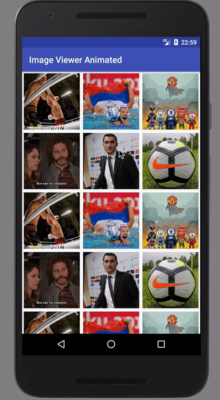

# Image Viewer Animated


[Sample projekt](https://github.com/shagspb/imageViewerAnimated/tree/master/sample)

Animated Transitions API customizable full screen image viewer for Fresco library that includes "pinch to zoom" and "swipe to dismiss" gestures. Based on [FrescoImageViewer](https://github.com/stfalcon-studio/FrescoImageViewer)




## Gradle

	dependencies {
	        compile 'com.github.shagspb:imageViewerAnimated:1.0.3'
	}
	
	
## License
```
Copyright 2015-2016 Relex

Licensed under the Apache License, Version 2.0 (the "License");
you may not use this file except in compliance with the License.
You may obtain a copy of the License at

    http://www.apache.org/licenses/LICENSE-2.0

Unless required by applicable law or agreed to in writing, software
distributed under the License is distributed on an "AS IS" BASIS,
WITHOUT WARRANTIES OR CONDITIONS OF ANY KIND, either express or implied.
See the License for the specific language governing permissions and
limitations under the License.
```
